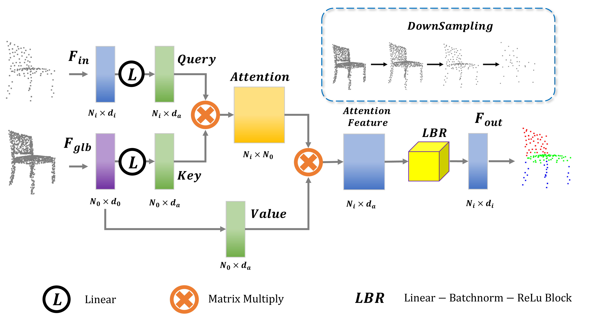

# ASBlock

Our pretrained model achieves the following performances on :

**Enhancing U-Net with Attention Skip Block for 3D Point Cloud Segmentation** (https://github.com/Ysc156/ASBlock)

## Results

### [3D Part Segmentation on ShapeNetPart](https://paperswithcode.com/sota/3d-part-segmentation-on-shapenet-part)

|                                                  Model name                                                   |    calss mIoU     |   Instance mIoU   | 
|:-------------------------------------------------------------------------------------------------------------:|:-----------------:|:-----------------:|
|  [PontNet++ + ASBlock](https://drive.google.com/drive/folders/12ToS0wrfljTAxSdYSPaYFRuWSzWQKJcr?usp=sharing)  |   82.6%(+0.1%)    |   86.0%(+0.6%)    |
|  [CurveNet + ASBlock](https://drive.google.com/drive/folders/12vuAIEn2F3NGWzi3YDwnI-9gOJHfmeWl?usp=sharing)   |   83.8%(+0.3%)    |   86.6%(+0.2%)    |
| [PointStack + ASBlock](https://drive.google.com/drive/folders/1jZB-5Jq4IGN8_K4Rz9tltQwNfpF8CEV3?usp=sharing)  |         -         |   87.5%(+0.3%)    |

### [Semantic Segmentation on S3DIS Area5](https://paperswithcode.com/sota/semantic-segmentation-on-s3dis-area5)

|                                                     Model name                                                      |     Mean IoU      | Class Mean Accuracy  | Overall Accuracy  |
|:-------------------------------------------------------------------------------------------------------------------:|:-----------------:|:--------------------:|:-----------------:|
|      [KPConv + ASBlock](https://drive.google.com/drive/folders/1qWY7UaAmgviy7ycHRPRj-sL4PG4zfExS?usp=sharing)       |   67.5%(+0.8%)    |     73.0%(+0.9%)     |   89.9%(+0.1%)    |
| [PointTransformer + ASBlock](https://drive.google.com/drive/folders/1xMPEHWA9xO1FzLmMhK1oiIQIXFVMCbMx?usp=sharing)  |   70.9%(+0.4%)    |     77.8%(+0.9%)     |       90.7%       |

## Acknowledgement

This code is derived from e.g., [Pointnet_Pointnet2_pytorch](https://github.com/yanx27/Pointnet_Pointnet2_pytorch), [CurveNet](https://github.com/tiangexiang/CurveNet), [PointStack](https://github.com/LongerVision/PointStack), [KPConv-PyTorch](https://github.com/HuguesTHOMAS/KPConv-PyTorch), [point-transformer](https://github.com/POSTECH-CVLab/point-transformer), and inspirited by several repos, e.g., [PCT](https://github.com/MenghaoGuo/PCT), [spotr](https://github.com/mlvlab/spotr).
